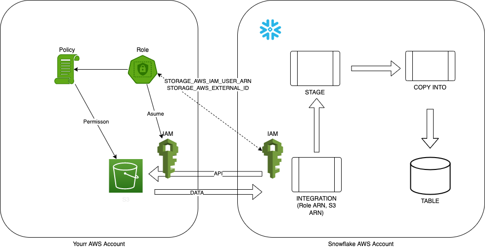

# AWS Resource for S3 Staging

## Create STORAGE INTEGRATION

with fake info:

- STORAGE_AWS_ROLE_ARN (something) 
- STORAGE_ALLOWED_LOCATIONS (something)

## AWS Resources

- Create a S3 bucket
- Create a IAM Policy for accesing the bucket

    - s3:GetObject
    - s3:ListObject

- Create a IAM Role for the Snowflake `INTEGRATION`

    - STORAGE_AWS_IAM_USER_ARN (STORAGE INTEGRATION)
    - STORAGE_AWS_EXTERNAL_ID (STORAGE INTEGRATION)

## Update STORAGE INTEGRATION:

- STORAGE_AWS_ROLE_ARN  (created IAM Role ARN)
- STORAGE_ALLOWED_LOCATIONS (created S3 ARN)

